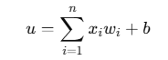
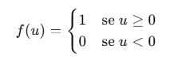
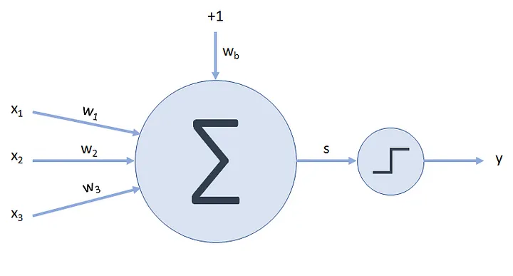

## Introdução e Estrutura Básica do Perceptron

O Perceptron foi o primeiro neurônio artificial criado, sendo o precursor das redes neurais artificiais. Foi desenvolvido por Frank Rosenblatt, em 1958.  
A proposta do Perceptron era atuar com o reconhecimento de padrões, empregando o uso de pesos e de outras características que foram inseridas nas redes neurais atuais.  

A solução de Rosenblatt apresentava apenas uma camada e classificava os valores de entrada entre os pertencentes a uma das duas classes cadastradas.  
O Perceptron pode ser entendido como um modelo simples de neurônio artificial que realiza decisões baseadas em múltiplas entradas.

---

## Estrutura Básica do Perceptron 

Entradas (xi): Os valores numéricos de entrada correspondem às características, são os valores que alimentam o neurônio. 
Pesos (wi): Cada característica tem um peso atribuído; isso determina sua importância. 
Saída (y): É calculada usando entradas e pesos. A saída é binária (1,0) ou um valor em um intervalo contínuo.
Bias (b): Valor constante adicionado ao somatório para ajustar o resultado.
Somatório: Combina a entrada(xi) e os pesos(wi):

<em>Figura 1: Fórmula do somatório.</em>

Função de ativação: Transforma o resultado 𝑢 em uma saída binária (0 ou 1) com a função degrau unitário:

<em>Figura 2: Função degrau unitário.</em>

Suponha que temos três entradas: `x₁`, `x₂` e `x₃`. Cada entrada é multiplicada por um peso associado: `w₁`, `w₂` e `w₃`. Os pesos determinam a importância de cada entrada no processo de decisão.

<em>Figura 3: Estrutura do perceptron.</em>

Além dessas entradas, o Perceptron também inclui uma entrada extra chamada bias, que tem valor fixo (geralmente 1) e também possui um peso associado `w_b`. O bias funciona como um ajuste fino, permitindo que o modelo tenha mais flexibilidade para aprender padrões nos dados.
O resultado desta soma ponderada, representada por `s`, alimenta uma unção de ativação que transforma esse valor em uma saída final, `y`.

No Perceptron clássico, essa função de ativação é uma função degrau, que funciona da seguinte forma:

- Se `s ≥ 0`: o neurônio é ativado → `y = 1`
- Se `s < 0`: o neurônio permanece desativado → `y = 0`

## Implementação do Perceptron

Código manual implementa a operação básica do Perceptron, onde:  
• u é o valor intermediário antes da ativação.  
• wi são os pesos.  
• xi são as entradas.  
• b é o bias (viés).

implementação: implementação: [perceptron.ipynb](perceptron.ipynb)

## 2. Explicação do cálculo Matemático do Perceptron

O código acima implementa a operação básica do Perceptron realiza a **soma ponderada das entradas** com seus respectivos pesos, e realiza a soma desse valor com o bias. A fórmula geral para o cálculo da entrada líquida (u) é:

\[
u = x_1 w_1 + x_2 w_2 + \cdots + x_n w_n + b
\]

Ou, em notação de somatório, como mostrado na imagem 1.

No exemplo realizado, foram adicionados valores para entradas, pesos e bias.

- Entradas:  x = [0.0, 0.0, 0.0] 
- Pesos: w = [1.0, 1.0, 1.0] 
- Bias: b = 0.5 

A multiplicação dos valores ocorre elemento a elemento,temos então:

x₁ ⋅ w₁ = 0.0 ⋅ 1.0 = 0.0  
x₂ ⋅ w₂ = 0.0 ⋅ 1.0 = 0.0  
x₃ ⋅ w₃ = 0.0 ⋅ 1.0 = 0.0

u = 0.0 + 0.0 + 0.0 + 0.5 = 0.5

Esse valor \( u \) é então passado para a **função de ativação**, que decide a saída do neurônio (0 ou 1).
No exemplo, a função utilizada foi a função degrau unitário, se o valor de 𝑢 for maior ou igual a zero, a saída será 1, caso contrário, a saída será 0.
